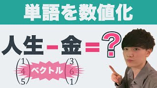

# Markov連鎖を用いたAIモデル
自由研究のときに使ったMarkov連鎖のAIモデル。Wikipedia日本版（日本：https://ja.wikipedia.org/wiki/日本）
## なぜ作った？
-AIモデルを実際に構築してみたかった。

-ラムダ技術部の動画の検証もしてみたかった。
### 参考動画（ラムダ技術部）はこちらから

&nbsp;&nbsp;&nbsp;&nbsp;

